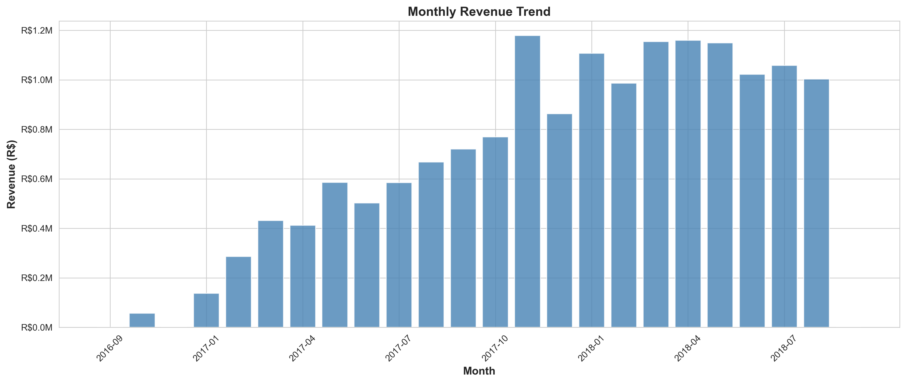
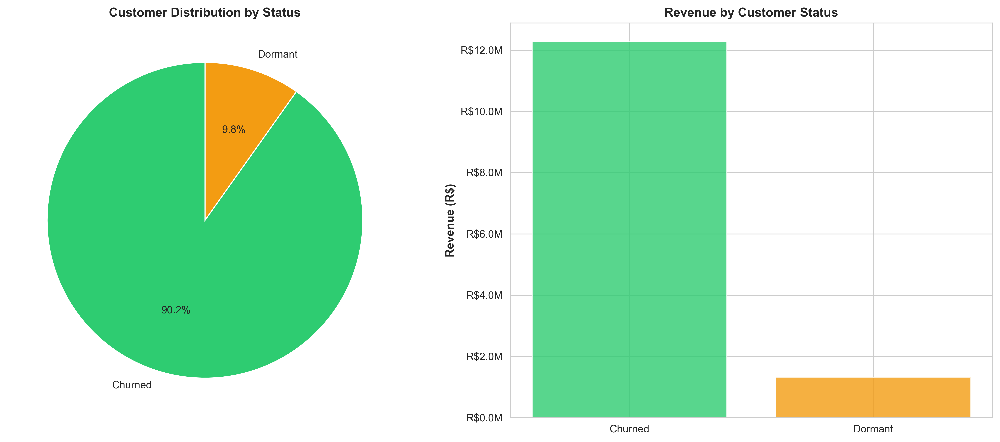
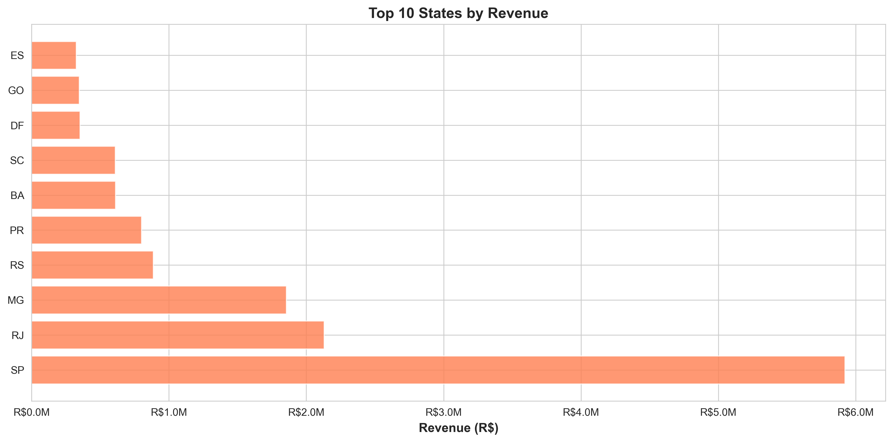

# E-Commerce End-to-End Business Transformation Analysis

**Status:** Complete Case Study | **Duration:** 3-4 weeks | **Scope:** 99,441 transactions

---

## 📊 Quick Facts

| Metric | Value |
|--------|-------|
| Total Revenue Analyzed | R$15.84M |
| Customer Base | 99,441 |
| Problems Identified | 6 critical issues |
| Financial Opportunity | R$14.6M (3-year benefit) |
| ROI | 273% |
| Payback Period | 9 months |

**Skills:** Advanced SQL | Financial Modeling | Business Analysis | Python (Pandas) | Data Visualization

---

## 🎯 Project Overview

A comprehensive business transformation analysis of a Brazilian e-commerce platform. Using 50+ SQL queries across 99,441 transactions, I identified 6 critical problems costing R$11.2M annually, developed a detailed root cause analysis, created a 3-year financial model showing 273% ROI, and designed a complete implementation roadmap.

**Outcome:** Actionable transformation strategy with 9-month payback period and R$14.6M projected benefit.

---

## 🔴 6 Critical Problems Identified

| Problem | Impact | Data Source |
|---------|--------|-------------|
| Retention Crisis | 100% single-purchase rate, R$4.7M churned | Query 2.1, 2.2 |
| Regional Disparity | 42% revenue from 1 state, 76% on-time in Northeast | Query 1.4, 4.2 |
| Product Quality | Office Furniture 3.49/5, 440+ unhappy customers | Query 3.3 |
| Operational Delay | 12.1 days fulfillment, 8.1% late deliveries | Query 4.1, 4.12 |
| Margin Erosion | 85.4% → 81.8%, R$496K annual loss | Query 5.5 |
| Payment Bottlenecks | R$218K lost revenue, 314 stuck orders | Query 4.11, 5.7 |

---

## 📈 Key Findings at a Glance

### Problem 1: Retention Crisis (CRITICAL)
- **Finding:** 100% single-purchase rate — zero repeat customers
- **Impact:** R$11.2M at risk (churned + at-risk combined)
- **Root Cause:** No retention strategy, no CRM, no loyalty program
- **Solution:** Implement loyalty program + post-purchase engagement
- **Data:** Returning customers spend 65% more (R$249 vs R$150)

### Problem 2: Regional Concentration
- **Finding:** 42% of customers from São Paulo (SP)
- **Impact:** Revenue concentration risk, growth limitation
- **Root Cause:** Single warehouse, no regional expansion strategy
- **Solution:** Add Northeast logistics partnerships, expand North
- **Data:** Northeast on-time delivery 76-84% vs SP 94%

### Problem 3: Product Quality Issues
- **Finding:** Office Furniture rated 3.49/5 (440 unhappy customers)
- **Impact:** Brand damage, prevents repeat purchases
- **Root Cause:** Supplier quality control gaps
- **Solution:** Implement seller performance standards, QC gates
- **Data:** Two sellers with ~400 negative reviews each

### Problem 4: Operational Inefficiency
- **Finding:** 12.1 days avg fulfillment, 8.1% late deliveries
- **Impact:** Customer frustration, competitive disadvantage
- **Root Cause:** Centralized warehouse, manual processes
- **Solution:** Automate order routing, add regional fulfillment
- **Data:** 89% orders single-item (R$1.3M upsell opportunity missed)

### Problem 5: Margin Erosion
- **Finding:** Gross margin declined 85.4% → 81.8% in 18 months
- **Impact:** R$496K annual profit erosion, unsustainable trajectory
- **Root Cause:** Shipping costs growing faster than revenue
- **Solution:** Optimize logistics, shift product mix to high-margin items
- **Data:** 57% orders have high freight costs (>20% of product value)

### Problem 6: Payment & Fulfillment Bottlenecks
- **Finding:** 314 stuck invoiced, 625 canceled, 609 unavailable orders
- **Impact:** R$218K lost revenue, customer frustration
- **Root Cause:** Manual processes, siloed systems
- **Solution:** Automate order routing, real-time inventory
- **Data:** Payment processing improving (15% → 0.41% failure rate)

---

## 💰 Financial Impact Summary

- **Total Revenue:** R$15.84M (Sep 2016 - Oct 2018)
- **Total Profit:** R$11.3M
- **At-Risk Revenue:** R$6.4M (41,118 customers)
- **Already Churned:** R$4.7M (29,898 customers)
- **Margin Erosion:** R$496K/year
- **Lost Orders:** R$218K
- **Total Problem Cost:** R$11.2M+

---

## 🚀 The Opportunity (3-Year Transformation)

### Financial Projections

| Metric | Current | Year 1 | Year 2 | Year 3 |
|--------|---------|--------|--------|--------|
| Annual Revenue | R$12M | R$15.2M | R$19.6M | R$24.7M |
| Retention Rate | 0% | 10% | 15% | 20% |
| Profit per Customer | R$114.93 | R$150 | R$200 | R$250+ |
| Gross Margin | 81.77% | 80% | 82%+ | 83%+ |

### ROI Summary

| Metric | Value |
|--------|-------|
| Total 3-Year Investment | R$3.91M |
| Total 3-Year Benefit | R$14.6M |
| Net Gain | R$10.68M |
| ROI | 273% |
| Payback Period | 9 months |
| 3-Year NPV (10% discount) | R$8.2M |

---

## 📊 Visual Insights

### Monthly Revenue Trend

### Customer Churn Analysis

### Top States by Revenue

---

## 📂 Repository Structure

- sql/ — 50+ SQL queries (6 files)
- analysis/ — Findings per section (5 markdown files)
- python/ — Analysis, visualization and ML scripts
- presentations/ — 20-slide executive deck
- documents/ — BRD, RCA, Financial Models PDFs
- case_study/ — Full case study and how to use guide
- visuals/ — 5 charts generated from data
- dashboards/ — Excel KPI dashboard
- data/ — Dataset info and sample results

---

## 🎓 How to Use This Repository

### For Hiring Managers (10 minutes)
1. Read this README (5 min)
2. Open presentations/Executive_Presentation.pptx (5 min)
3. Check case_study/CASE_STUDY.md for full summary

### For Data Analysts (1-2 hours)
1. Review SQL queries in sql/ folder
2. Check analysis/ for detailed findings per section
3. Run Python scripts in python/

### For Business Teams (2-3 hours)
1. Read Business Requirements Document in documents/
2. Review Financial Models PDF
3. Check Implementation Roadmap

---

## 🚀 Quick Start

### Run SQL Queries
1. Download dataset from Kaggle — kaggle.com/datasets/olistbr/brazilian-ecommerce
2. Open SQLite Studio and create new database
3. Run sql/01_setup.sql to create all 9 tables
4. Import CSV files into each table
5. Run any of 02 through 06 SQL files

### Run Python Scripts
1. cd python
2. pip install -r requirements.txt
3. python analysis.py
4. python visualizations.py
5. python churn_prediction.py

---

## 💼 Skills Demonstrated

**Data Analysis & SQL** — 50+ queries, RFM segmentation, cohort analysis, churn prediction

**Business Analysis** — Root cause analysis, 15-page BRD, stakeholder analysis

**Financial Modeling** — 3-year projections, 273% ROI, NPV, sensitivity analysis

**Python** — Pandas, Matplotlib, Seaborn, Scikit-learn (logistic regression)

**Strategic Thinking** — 4-phase roadmap, risk mitigation, change management

**Communication** — 20-slide executive presentation, technical documentation

---

## 📊 Data Source

**Brazilian E-Commerce Public Dataset by Olist**
- Source: Kaggle — kaggle.com/datasets/olistbr/brazilian-ecommerce
- License: CC0 (Public Domain)
- Period: September 2016 - October 2018
- Records: 99,441 orders | 32,951 products | 72 categories

---

## 📧 About This Project

Built as a comprehensive business analysis portfolio project demonstrating end-to-end skills from raw data to executive presentation.

**Project Status: Complete ✅ | Last Updated: June 2026**